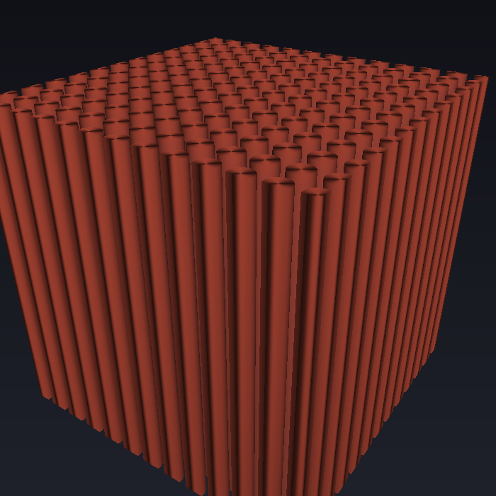
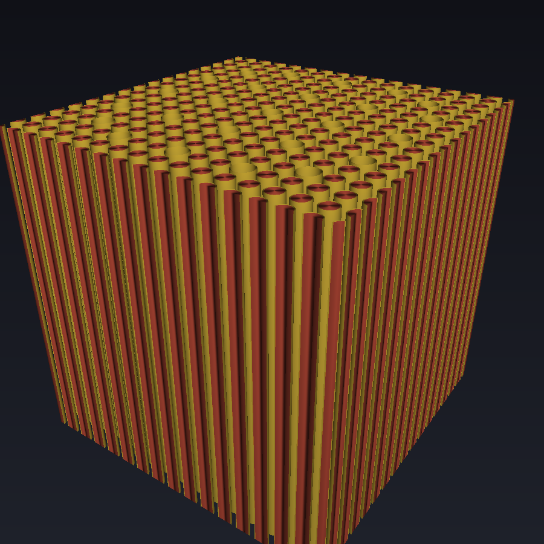
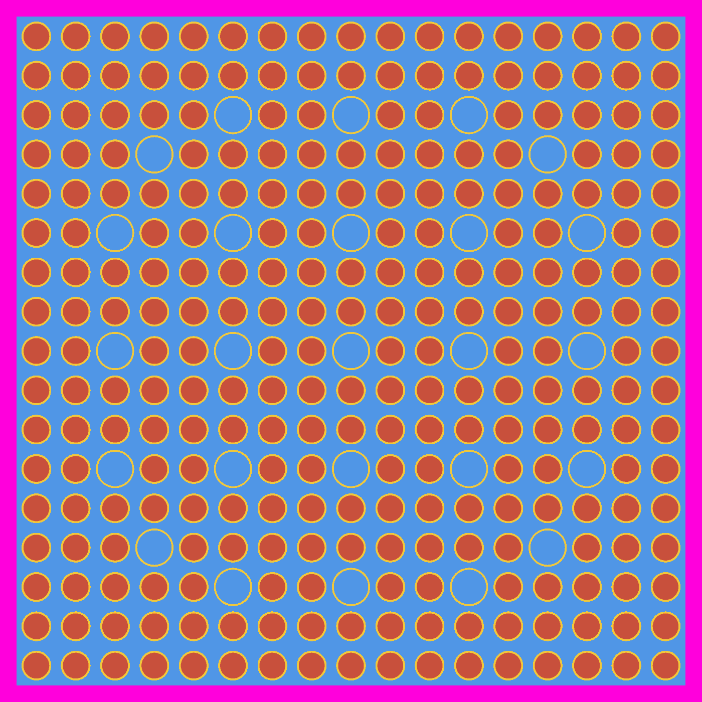
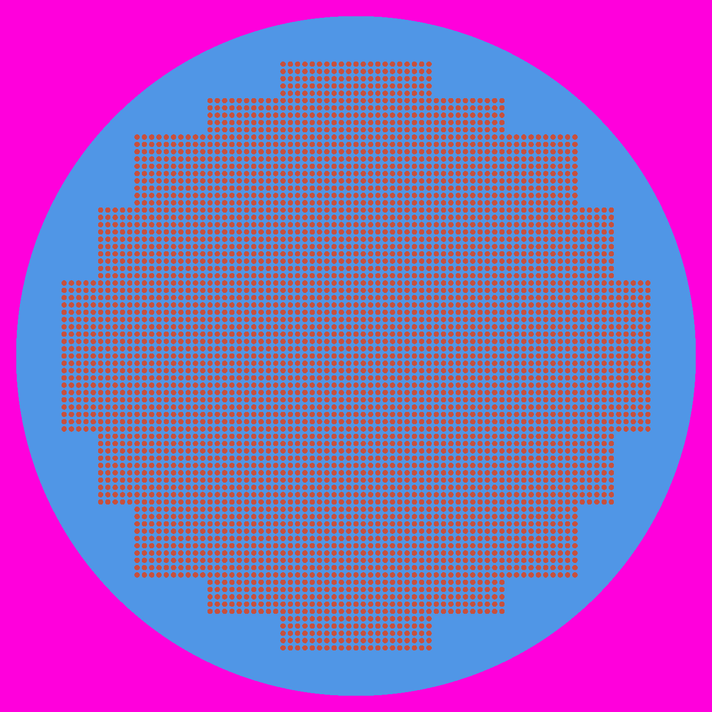
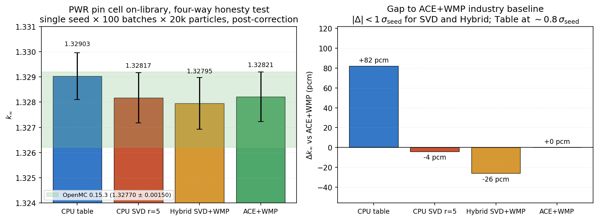
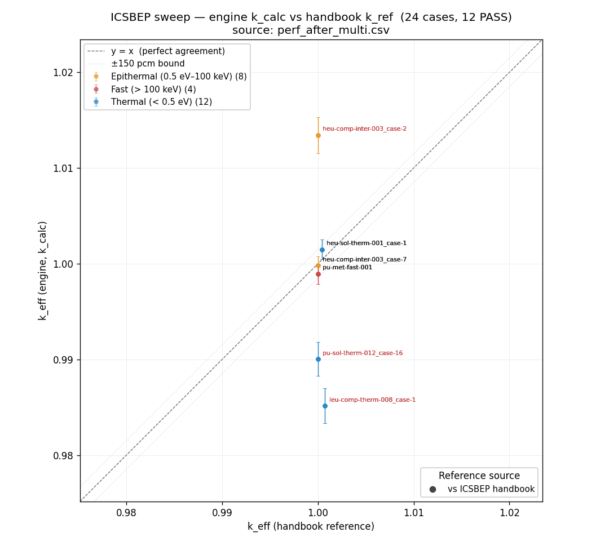
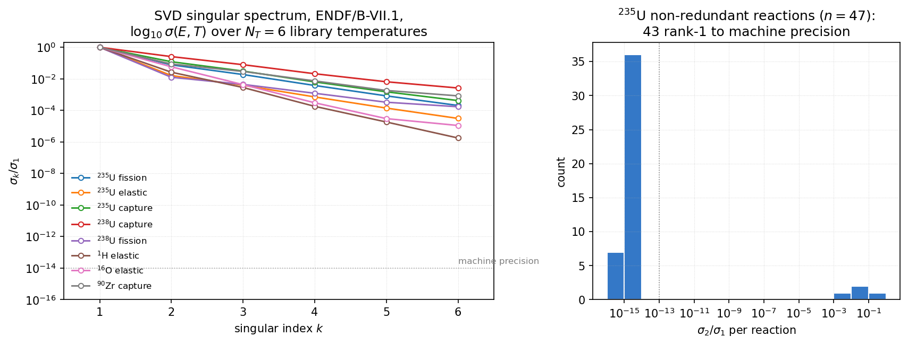
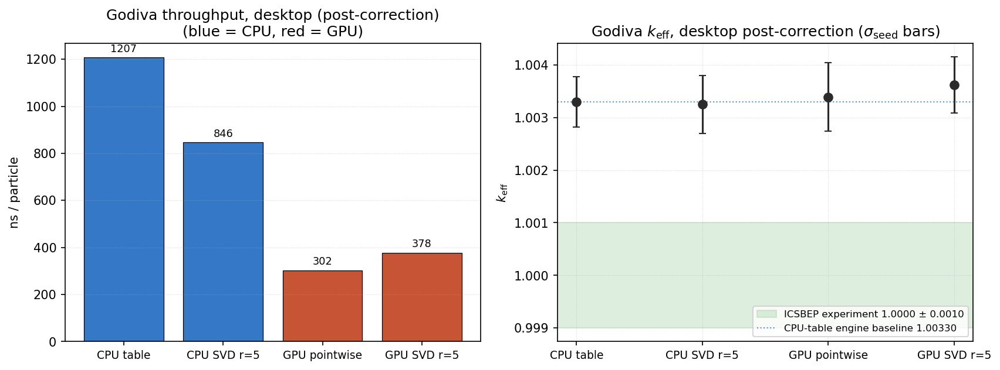
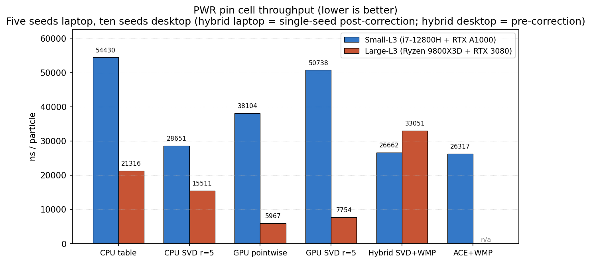
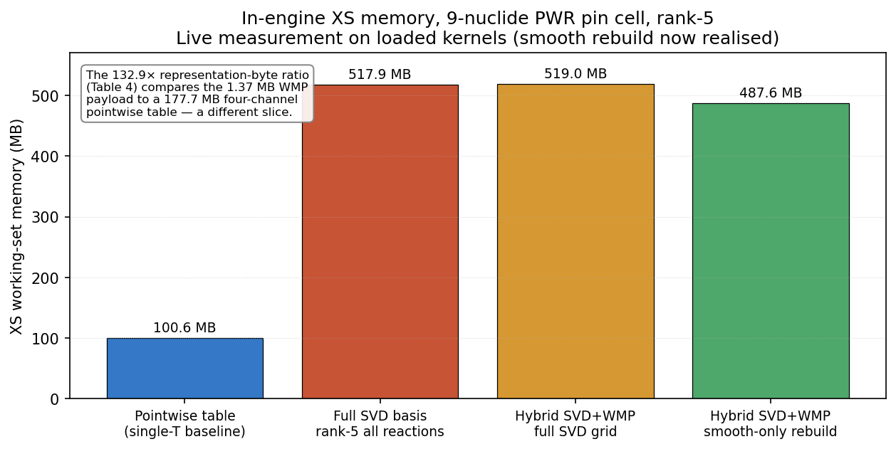

# open_rust_mc

[](https://github.com/sorcerer86pt/open_rust_mc/releases/latest)
[](#tests)
[](LICENSE)

A pure-Rust continuous-energy Monte Carlo radiation-transport engine —
neutron k-eigenvalue and fixed-source, photon transport, coupled
neutron-photon γ-heating, burnup depletion, time-dependent point
kinetics, and continuous-energy adjoint. It reads OpenMC HDF5 nuclear
data directly (no C dependency), runs on CPU (rayon) **and** the GPU,
and ships an interactive cross-section / 3-D scene viewer.

<p align="center">
  
  
</p>
<p align="center"><em>
  Scene geometry rendered straight from the engine's own recursive CSG
  by the built-in cross-vendor GPU ray-caster — left: an LCT-008 fuel-rod
  cluster (water rendered translucent so the pin forest reads in 3-D);
  right: a depth-3 recursive 17×17 PWR assembly.
</em></p>

## From a compression study to a full transport engine

This project started as a **single research question**, written up in
[`paper/main.tex`](paper/main.tex): *can a truncated SVD of the
temperature-dependent cross-section grid replace the pointwise table a
Monte Carlo code reads at every collision, and is it faster?* Answering
that honestly meant building enough of a real MC engine around the SVD
provider to measure it against a credible baseline — not a toy.

That scaffolding kept growing, and it became the actual artifact. Today
`open_rust_mc` is a genuine continuous-energy MC code:

- **Four interchangeable cross-section providers** behind one
  `XsProvider` trait — pointwise `Table`, truncated `Svd`, and two
  Windowed-Multipole hybrids — so SVD can be graded against the
  industry-standard representations on the *same* geometry, in the same
  run.
- **Recursive universe/lattice geometry** (rectangular + hexagonal),
  per-universe BVH, validated against OpenMC on Godiva, a PWR pin cell,
  a 17×17 assembly, and a 375-case ICSBEP corpus.
- **Coupled neutron–photon** transport with full condensed-history
  electrons; **CRAM** depletion; **point kinetics**; **continuous-energy
  adjoint** + random-ray FW-CADIS variance reduction.
- A **GPU backend** that runs the same physics, and a **cross-vendor GPU
  scene renderer** (the images above) written once and compiled to
  CUDA, ROCm, Vulkan, Metal, and WebGPU.

The headline SVD result is in the paper and reproduced
[below](#the-svd-verdict-the-original-question) — and it's an honest one:
SVD wins on small fast-spectrum problems and **loses** on realistic
thermal pin cells. This engine is the measuring instrument that made
that statement defensible.

<a name="tests"></a>
> **441 / 441** library tests + 9 integration tests pass on every push
> (`cargo test`); **447 / 447** with `--features cuda`.

## Highlights

- **Four cross-section providers, one trait.** Pointwise `Table`, rank-*k*
  `Svd`, `HybridSvdWmp`, `HybridTableWmp` — selectable at runtime via
  `--mode`. A three-way honesty test runs them back-to-back on identical
  geometry.
- **Recursive geometry.** `CoordStack`-based universes, rectangular +
  hexagonal lattices, per-cell `Mat3` rotation, per-universe BVH. Full
  17×17 PWR assembly and N-ring hex mini-cores ship as benchmarks.
- **Cross-vendor GPU, two ways.** A CUDA transport backend (event-batched,
  recursive-CSG, sm_60+), **and** a new [CubeCL](https://github.com/tracel-ai/cubecl)
  renderer that compiles one Rust kernel to CUDA / ROCm / Vulkan / Metal /
  WebGPU — running the geometry walk in **f64** on any GPU, no vendor SDK.
- **Coupled neutron-photon.** PWR γ-heating runs end-to-end with
  Bethe-Bloch + Highland MS + Seltzer-Berger bremsstrahlung electron
  transport; fuel/gap/clad/water split agrees with OpenMC 0.15.3 within
  1 pp.
- **Depletion.** CRAM-16 / CRAM-48 with on-the-fly chain-XS spectrum
  collapse and a fresh-corrector predictor; Xe equilibrium matches
  analytic to 1e-4.
- **Variance reduction.** Forward weight windows + multigroup random-ray
  (Tramm 2018, immortal-ray Tramm-Siegel 2021) feeding a measured
  FW-CADIS pipeline — 4.32× FOM on 200 cm of water.
- **ENDF/B-VIII.1 by default**, with VIII.0 / VII.1 / JEFF-3.3 supported;
  sibling-`thermal/` layout handled transparently; idempotent
  natural-element migration for benchmark JSONs.
- **Python (PyO3) front-end** — `Scene`, `Material`, `Surface`,
  `run_eigenvalue`, `run_icsbep_case`, full provider / runner / depletion
  plumbing.

## See the geometry

The `preview_scene` binary renders any scene JSON — 2-D cross-section or
3-D — directly from the engine's recursive CSG. No meshing: every pixel
is an exact ray-cast (or cell lookup) through the same geometry the
transport kernels walk.

<p align="center">
  
  
  
</p>
<p align="center"><em>
  Left: Godiva bare-HEU sphere (3-D GPU ray-cast). Middle / right: 2-D
  XY cross-sections of the PWR assembly and the LCT-008 cluster tank —
  fuel pins, guide tubes, and moderator resolved per-pixel.
</em></p>

```powershell
# Cross-vendor GPU 3-D render (Vulkan / Metal / DX12 / CUDA / ROCm) — f64
cargo run --release --bin preview_scene -- `
    bench/icsbep/leu-comp-therm-008_case-1.json data\endfb-viii.1-hdf5\neutron `
    --cubecl-out lct008.png --cam-azim 35 --cam-elev 30 --zoom 1.2

# 2-D cross-section to PNG (no GPU needed)
cargo run --release --bin preview_scene -- `
    bench/icsbep/pwr_assembly_17x17.json data\endfb-viii.1-hdf5\neutron `
    --png-out assembly_xy.png --resolution 1400
```

## Quick start

### Prerequisites

- Rust stable (1.79+), `cargo`.
- (Optional) CUDA toolkit 12.x + NVRTC for the CUDA transport backend.
- (Optional) Python 3.9+ + [`maturin`](https://www.maturin.rs/) for the
  Python wheel.

The cross-vendor GPU renderer needs **no** vendor SDK — it runs on
whatever Vulkan / Metal / DX12 adapter the OS provides.

### Build

```powershell
git clone https://github.com/sorcerer86pt/open_rust_mc
cd open_rust_mc/rust_prototype
cargo build --release                       # CPU + cross-vendor GPU renderer
cargo build --release --features cuda       # + CUDA transport backend
cargo test --lib                            # 441 / 441
cargo test --lib --features cuda            # 447 / 447
```

### Download nuclear data (ENDF/B-VIII.1, ~6.5 GB)

```powershell
.\scripts\setup_nuclear_data.ps1            # VIII.1 (default)
.\scripts\setup_nuclear_data.ps1 -All       # all four supported libs
.\scripts\setup_nuclear_data.ps1 -Vii1      # legacy VII.1 only
```

### Run a benchmark

Godiva HEU sphere, end-to-end, SVD provider, rank-5:

```powershell
cargo run --release --bin godiva -- data\endfb-viii.1-hdf5\neutron `
  --rank 5 --batches 80 --inactive 15 --particles 10000
```

A single ICSBEP case via Python; full corpus sweep:

```powershell
cd rust_prototype/bindings/python
maturin develop --release --features cuda
cd ../../..
python rust_prototype/bindings/python/examples/icsbep_run.py heu-met-fast-001_case-1 gpu
.\rust_prototype\bindings\python\examples\run_benchmark.ps1   # full corpus, auto GPU/CPU
```

## Benchmarks

All k_eff numbers carry a **scope tag** — `[godiva]` = 3-nuclide HEU
sphere, `[pwr]` = 9-nuclide PWR pin cell, `[assembly]` = depth-3 17×17,
`[icsbep]` = handbook regression. A `[micro]` headline routinely shrinks
or inverts under `[pwr]`/`[assembly]`; the tags keep that honest. See
[`STATUS.md`](STATUS.md) for the fully audited table.

### Validation against OpenMC and ICSBEP

<p align="center">
  
</p>
<p align="center"><em>
  PWR pin-cell four-way honesty test: all four providers land inside
  OpenMC 0.15.3's band; SVD r=5 and Hybrid SVD+WMP sit within 1σ of the
  ACE+WMP industry baseline. <code>[pwr]</code>
</em></p>

<p align="center">
  
</p>
<p align="center"><em>
  ICSBEP sweep: engine k_calc vs handbook k_ref across fast / epithermal
  / thermal cases, with the ±150 pcm acceptance band. <code>[icsbep]</code>
</em></p>

### The SVD verdict (the original question)

<p align="center">
  
</p>
<p align="center"><em>
  Why SVD is even plausible: the temperature-dependent σ(E,T) grid is
  extremely low-rank — 43 of 47 non-redundant <sup>235</sup>U reactions
  are rank-1 to machine precision, and the singular values fall off a
  cliff. (For these nuclides the reconstruction <strong>saturates by
  rank 15</strong>: k_eff is bit-identical at rank 15 and rank 60.)
</em></p>

<p align="center">
  
  
</p>
<p align="center"><em>
  Throughput (ns/particle, lower is better). On a 3-nuclide fast
  spectrum SVD edges out the table; on a 9-nuclide thermal pin cell with
  S(α,β) it loses — the reconstruction cost is paid on every collision
  and there are far more of them.
</em></p>

<p align="center">
  
</p>
<p align="center"><em>
  Working-set memory at a <strong>single</strong> temperature: here the
  rank-5 SVD basis is ~5× the pointwise table. But this is SVD's
  <em>worst</em> framing — see below.
</em></p>

**Where SVD actually pays for itself: memory across temperatures, and
GPU residency.** The bar chart above is single-temperature, which is
exactly where a pointwise table is cheapest. The picture flips for the
things SVD was built for:

- **Off-table temperature reconstruction.** A pointwise representation
  stores a *full energy grid per temperature* — and library sets run
  {294, 600, 900, 1200, 2500} K, with Doppler feedback and depletion
  wanting points *between* them. SVD stores **one** rank-*k* basis
  `B = UₖΣₖ` plus a tiny `N_T×k` factor, and reconstructs *any*
  temperature on the fly via the Ducru weight kernel (exact at the
  library points). Its footprint is near-flat in the number of
  temperatures while the table's grows linearly — and in the off-library
  case the table must load **two** columns per nuclide and stochastically
  interpolate per collision. That's the regime the paper identifies as
  where SVD's single-basis reconstruction pays off
  (`paper/sections/memory_vs_precision.tex`).
- **GPU memory mapping & cache residency.** The factored form is small,
  contiguous, and regular — it maps cleanly into GPU memory and stays
  cache-resident, versus chasing large irregular pointwise tables with a
  per-nuclide binary search per lookup. Cache-resident reconstruction
  was this project's *original* thesis, and it's the regime where the
  rank-*k* FMA sequence beats the table's memory-latency-bound lookup.

So the throughput story is spectrum-dependent (win on fast, lose on
thermal-with-S(α,β)), but the *memory* story favours SVD precisely when
it matters: many temperatures, and GPU.

| Metric | Scope | Value | Source |
|---|---|---|---|
| Lib tests (default / `cuda`) | — | **441 / 441** · **447 / 447** | `cargo test --lib` |
| ICSBEP family suite (CPU + CUDA) | `[icsbep]` | **6 / 6 PASS** under `max(150 pcm, 2σ)` | `outputs/cuda_runs_after_rank_fix.txt` |
| SVD vs Table on Godiva | `[godiva]` | **1.22× faster**; 5.14× memory @ single-T | `paper/`, `outputs/pareto/` |
| SVD vs Table on PWR pin cell | `[pwr]` | **1.25× *slower***; 5.12× memory @ single-T | same |
| SVD memory vs N-temperature table | `[micro]` | near-flat in N_T vs linear — SVD wins for many T | `paper/sections/memory_vs_precision.tex` |
| PWR γ-heating split vs OpenMC | `[photon]` | fuel 84.1 / clad 9.8 / water 5.7 % (gap 0) | `outputs/pwr_gamma_heating_benchmark.txt` |
| RR-CADIS + NEE FOM at 14 mfp (200 cm water) | `[shield]` | **1.75× analog** | `outputs/method_comparison_2026-05-08.txt` |
| Peak GPU throughput (Godiva, RTX 3080) | `[godiva]` | ~1.2 M histories/s at 1M particles | `outputs/saturation_1000000.csv` |

**The honest reading** ([`paper/main.pdf`](paper/main.pdf)): on raw
per-collision throughput, SVD beats the pointwise table by ~22 % on small
fast-spectrum problems and loses by ~25 % on realistic thermal PWR pin
cells. At a single temperature it costs ~5× memory — but it reconstructs
*any* temperature from one basis (flat memory in N_T where a table is
linear) and maps far better into GPU/cache memory than irregular
pointwise tables. The engine exists to make all of that *measurable*, not
to sell one answer.

## Architecture

One particle-transport loop runs against any geometry, any cross-section
provider, and either backend:

```
┌──────────────────────────────────────────────────────────────┐
│  Scene JSON                                                    │
│  └─> material_resolve  ─>  XsProvider                          │
│      (natural-element       ├── Table   (pointwise)            │
│       expansion, thermal    ├── Svd     (rank-k FMA)           │
│       binding, kernel       ├── HybridTableWmp                 │
│       dedup)                └── HybridSvdWmp                   │
│                                                                │
│  └─> Geometry  ─>  Surface / Cell / Region / Universe          │
│                    recursive CoordStack + per-universe BVH     │
│         │                                                      │
│         ├─> EigenvalueRunner ─> CpuRunner  (rayon, history)    │
│         │                       CudaRunner (sm_60+, event)     │
│         │                                                      │
│         └─> geometry::flat ─> CubeCL renderer (CUDA/ROCm/      │
│             (shared SoA)        Vulkan/Metal/WebGPU, f64)      │
└──────────────────────────────────────────────────────────────┘
```

Key modules under `rust_prototype/src/`:

- `kernel.rs`, `decompose.rs`, `cp_decompose.rs` — SVD reconstruction +
  decomposition.
- `table.rs`, `wmp.rs` — pointwise + Windowed Multipole providers.
- `hdf5_reader.rs`, `thermal.rs` — pure-Rust HDF5 + S(α,β).
- `geometry/` — recursive universes, BVH, hex/rect lattices, and
  `flat.rs` (backend-agnostic Geometry → SoA flattening, shared by both
  GPU paths).
- `physics/`, `transport/` — collision, scatter, kinematics, `simulate`,
  `dispatch`, `xs_provider`, `hybrid_xs`, weight windows, kinetics,
  adjoint.
- `photon/` — Compton, Rayleigh, photoelectric, pair, brems, electron.
- `random_ray/` — multigroup TRRM (forward + adjoint + immortal), CADIS.
- `depletion/` — CRAM, chain, predictor-corrector.
- `gpu_recursive.rs`, `gpu_transport.rs` — CUDA transport backend.
- `gpu_render.rs` — **CubeCL cross-vendor geometry renderer**.

## Cross-section providers

All four implement `XsProvider`; selectable at runtime via `--mode`.

| Mode | Provider | What it does |
|------|----------|--------------|
| `table` | Pointwise | OpenMC-style binary search + log-log interpolation per reaction |
| `svd` | Truncated SVD | Rank-*k* reconstruction, one FMA sequence per lookup |
| `hybrid_svd_wmp` | SVD + WMP | SVD everywhere, WMP (pole/residue + Faddeeva) inside the RRR |
| `hybrid_table_wmp` | Table + WMP | Pointwise everywhere, WMP in the RRR — industry low-memory baseline |

Off-library temperatures use stochastic pseudo-interpolation (Table /
Hybrid) or partition-of-unity 3-point Ducru reconstruction (SVD).

## GPU: two backends

**CUDA transport (`--features cuda`, sm_60+).** Recursive cell-find /
trace-step bit-exact vs CPU (≤ 9.3e-11 rel-err), constant-XS event-batched
eigenvalue, multi-slot S(α,β), per-nuclide kernel cache, PHYSOR-2022
refill pool. Used by `CudaRunner` for production sweeps.

**CubeCL geometry renderer (always on).** The `preview_scene --cubecl-out`
path ray-casts the recursive CSG in a single CubeCL `#[cube]` kernel that
compiles to **CUDA, HIP/ROCm, Vulkan, Metal, and WebGPU** — one Rust
source, every GPU. It runs in **f64** (verified on the wgpu/Vulkan
backend wherever the adapter exposes `SHADER_F64`), so the render matches
the CPU/CUDA geometry walk exactly, with analytic surface normals and
front-to-back alpha compositing for translucent moderator fluids. The SoA
geometry layout (`geometry::flat`) is shared with the CUDA upload path so
the device representation has one source of truth.

> CubeCL is also the migration target for the transport kernels: porting
> the hand-written `gpu/cuda/*.cu` to CubeCL would collapse the CUDA-only
> backend into the same write-once-run-anywhere path (NVIDIA + AMD +
> Vulkan), in f64. That work is in progress.

## Python bindings

```python
from open_rust_mc import Scene, Material, Sphere, Settings, run_eigenvalue

fuel = (Material("HEU", temperature=294.0)
    .add_nuclide("U234.h5", atom_density=0.000483, awr=232.029, nubar=2.49)
    .add_nuclide("U235.h5", atom_density=0.04509,  awr=233.025, nubar=2.43)
    .add_nuclide("U238.h5", atom_density=0.00265,  awr=236.006, nubar=2.49))

scene = (Scene("data/endfb-viii.1-hdf5/neutron")
    .add_material("heu", fuel)
    .add_surface("boundary", Sphere(r=8.7407, bc="vacuum"))
    .add_cell("fuel", region="-boundary", fill="heu", temperature=294.0)
    .add_cell("outside", region="+boundary"))

result = run_eigenvalue(scene, Settings(batches=50, inactive=10, particles=5000))
print(result.k_eff, result.k_sigma)
```

Full Scene builder + Material API in [`PYTHON.md`](PYTHON.md).

## Documentation

- [`CLAUDE.md`](CLAUDE.md) — engineer-facing project memory: invariants,
  layout, build commands.
- [`STATUS.md`](STATUS.md) — current capabilities, audited headline
  numbers, open work.
- [`PYTHON.md`](PYTHON.md) — Python API reference.
- [`BENCHMARKS.md`](BENCHMARKS.md) — bench-suite layout + scene-JSON schema.
- [`ICSBEP.md`](ICSBEP.md) — phased ICSBEP rollout plan.
- [`paper/main.tex`](paper/main.tex) — the SVD cross-section compression
  paper (compiled to `paper/main.pdf`).

## License

MIT. See [`LICENSE`](LICENSE) (every source file carries
`SPDX-License-Identifier: MIT`).
